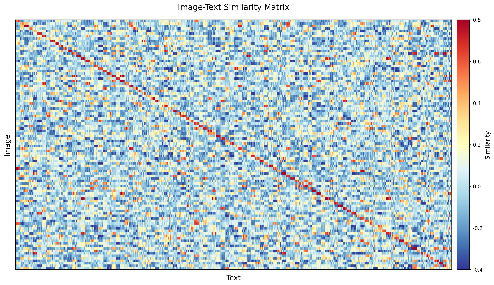
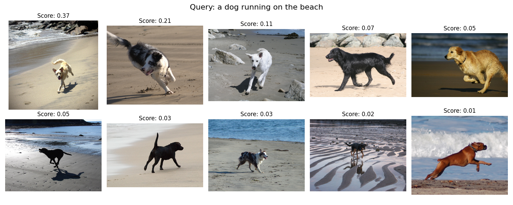
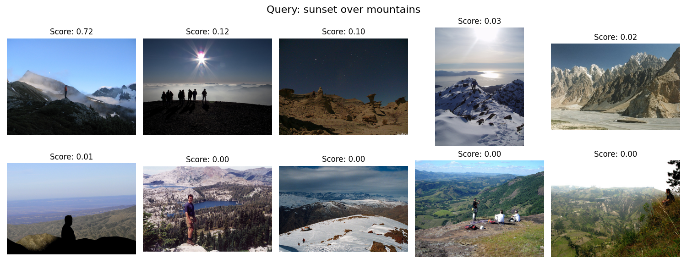

# 轻量级图文匹配模型

## 项目简介

本项目是一个基于 CLIP (Contrastive Language-Image Pre-training) 架构的轻量级图文匹配模型实现。该项目提供了完整的训练、评估和可视化流程，可用于图像检索、文本检索等多模态任务。项目采用 PyTorch 框架。

## 主要特点

- 基于 CLIP 架构的轻量级实现
- 支持多种嵌入维度（256, 512）的模型训练
- 提供完整的数据处理、训练和评估流程
- 包含丰富的可视化工具，用于分析模型性能
- 支持图像到文本和文本到图像的双向检索

## 代码结构

```
├── model.py           # 模型定义
├── dataset.py         # 数据集处理
├── train.py           # 训练脚本
├── evaluate.py        # 评估脚本
├── prepare_data.py    # 数据预处理
├── split_dataset.py   # 数据集划分
├── alignment_visualization.py  # 可视化工具
└── utils/
    └── text_utils.py  # 文本处理工具
```

## 技术栈

- Python 3.8+
- PyTorch 2.0+
- torchvision (提供 ResNet50 预训练模型和图像处理工具)
- transformers (提供 BERT 预训练模型)
- Pillow
- numpy
- tqdm
- matplotlib

## 核心功能

### 1. 模型架构
- **图像编码器**: 使用预训练的 ResNet50，并添加投影头
- **文本编码器**: 使用预训练的 BERT，并添加投影头
- **温度参数**: 实现可学习的温度参数，用于调节相似度计算

### 2. 数据处理
- 支持 Flickr8k 数据集格式
- 实现图像和文本的数据增强
- 提供数据集划分功能（训练集/验证集/测试集）
- 支持一图多文本的数据组织形式（每张图片对应5个描述）

### 3. 训练功能
- 支持混合精度训练
- 实现余弦学习率调度
- 提供模型检查点保存和加载
- 支持训练过程可视化

### 4. 评估指标
- R@K (K=1,5,10) 检索准确率
- 图像到文本和文本到图像的双向评估
- 损失值监控
- 特征对齐度分析

### 5. 可视化工具
- t-SNE 特征分布可视化
- 相似度矩阵热力图
- 检索结果示例展示

## 快速开始
### 1. 环境配置

1. 克隆项目并安装依赖：

```bash
pip install -r requirements.txt
```

### 2.数据准备

1. 准备数据集（以 Flickr8k 为例）：
   - 将图像文件放置在 `data/flickr8k/images/` 目录下
   - 准备对应的描述文件

2. 运行数据预处理：

```bash
python prepare_data.py
python split_dataset.py
```

### 3.模型训练

运行训练脚本：

```bash
python train.py
```

训练过程将自动保存以下文件：
- 最佳模型权重：`checkpoints/best_model_{embed_dim}.pth`
- 训练历史记录：`training_history_{embed_dim}.pth`

### 4.模型评估

运行评估脚本：

```bash
python evaluate.py
```

评估指标包括：
- R@K (K=1,5,10) 检索准确率
- 图像到文本和文本到图像的双向评估

### 5.特征对齐可视化

运行可视化脚本：

```bash
python alignment_visualization.py
```

可视化结果包括：
- t-SNE 特征分布图
- 相似度矩阵热力图
- 检索结果示例


## 示例结果

### 相似度矩阵热力图


### 3. 检索结果示例







## 性能指标
### 在 Flickr8k 测试集上的典型性能：
#### R@1:
  图像→文本: 31.73%
  文本→图像: 30.05%
#### R@5:
  图像→文本: 60.49%
  文本→图像: 47.33%
#### R@10:
  图像→文本: 72.10%
  文本→图像: 60.10%


## 许可证

本项目基于 MIT 许可证开源。

## 参考

- [OpenAI CLIP](https://github.com/openai/CLIP)
- [Learning Transferable Visual Models From Natural Language Supervision](https://arxiv.org/abs/2103.00020)
